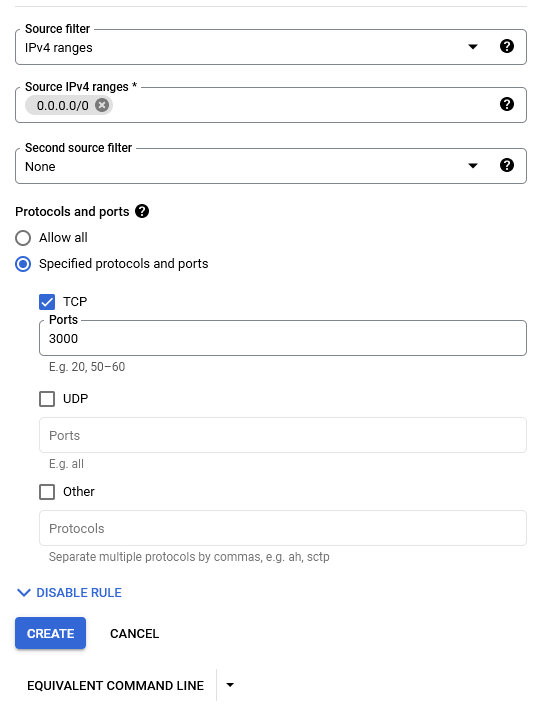

# Google Cloud with Services already running

Use PowerShell, so you don't need to copy paste the names of the pods.
1. Log in from your command line with
    ```console
    gcloud auth login
    ```

2. Connect: at <https://console.cloud.google.com/kubernetes> click on the 3 dots and select connect, copy the command-line statement and run it in your PowerShell

3. Check if the node is running
    ```console
    kubectl get nodes
    ```

4. Check if pods are running with
    ```console
    kubectl get pods --namespace monitoring
    ```

5. Forward the port of prometheus-server
    ```console
    kubectl port-forward --namespace monitoring $(kubectl get pod --namespace monitoring --selector="app=prometheus-server" --output jsonpath='{.items[0].metadata.name}') 8080:9090
    ```
    and open [localhost:8080](localhost:8080)

6. Open a new PowerShell and forward the port of alertmanager
    ```console
    kubectl port-forward --namespace monitoring $(kubectl get pod --namespace monitoring --selector="app=alertmanager" --output jsonpath='{.items[0].metadata.name}') 8081:9093
    ```
    and open [localhost:8081](http://localhost:8081)

7. Open a new PowerShell and forward the port of grafana
    ```console
    kubectl port-forward --namespace monitoring $(kubectl get pod --namespace monitoring --selector="app=grafana" --output jsonpath='{.items[0].metadata.name}') 8082:3000
    ```
    and open [localhost:8082](http://localhost:8082)

8. Login with<br>
    Username: admin<br>
    Password: admin<br>
    Skip setting new password

9. Open a new PowerShell and forward the port of Application1
    ```console
    kubectl port-forward --namespace monitoring $(kubectl get pod --namespace monitoring --selector="app=application1" --output jsonpath='{.items[0].metadata.name}') 8083:8000
    ```
    and open for example [localhost:8083/delay/2](http://localhost:8083/delay/2) for a 2 seconds delay

10. Open a new PowerShell and forward the port of Application2
    ```console
    kubectl port-forward --namespace monitoring $(kubectl get pod --namespace monitoring --selector="app=application2" --output jsonpath='{.items[0].metadata.name}') 8084:8001
    ```
    and open [localhost:8084/](http://localhost:8084/) -> the Service should be Unavailable

11. Open a new PowerShell and open CLI for Redis
    ```console
    kubectl exec -i -t $(kubectl get pod --namespace monitoring --selector="app=redis" --output jsonpath='{.items[0].metadata.name}') -n monitoring --container redis -- redis-cli
    ```

12. Open a new PowerShell and forward the port of Redis
    ```console
    kubectl port-forward --namespace monitoring $(kubectl get pod --namespace monitoring --selector="app=redis" --output jsonpath='{.items[0].metadata.name}') 8085:9121
    ```
    and open [localhost:8085/metrics](http://locahlost:8085/metrics)

## Overview of the ports (<localhost:xxxx>):
* 8080 -> prometheus-server
* 8081 -> alertmanager
* 8082 -> grafana
* 8083 -> Application1 (= Sleep)
* 8084 -> Application2 (= Not available)
* 8085 -> Redis

# First setup with Google Cloud

## Prerequisites
1. Account in [Google Cloud](http://cloud.google.com/) and start a trial version
2. Install [Google Cloud SDK](https://cloud.google.com/sdk/install) Run the command: 
    ```console
    gcloud version
    ```
3. If not done before: run the ```kubectl``` installation command
    ```console
    gcloud components intall kubectl
    ```

## Setup Cluster
1. Log in from your command line with
    ```console
    gcloud auth login
    ```

2. Open the [Kubernetes Engine Overview](https://console.cloud.google.com/kubernetes)

3. Click on *Create Cluster* and select "Standard: you manage your cluster"

4. Create a cluster with the *default* settings except for the *Number of nodes* where you only need 1:

    
    
    

    Standard machine type is
    

    Changed the Machine type to e2-standard-4 so CPU should be no problem in future
    

5. As soon as your cluster is ready, click on *Connect* and copy and paste this command into your terminal

6. Now your `kubectl` (i.e., the Kubernetes command-line tool) should be configured for your cluster. In order to verify this, execute the command: 

    ```console
    kubectl get nodes
    ```

7. Change to the directory in the git folder and run the commands for <B>Setup Prometheus</B> from the ```README.md``` 

8. Check if it is running with
    ```console
    kubectl get pods --namespace monitoring
    ```

9. Forward the port
    ```console
    kubectl port-forward --namespace monitoring $(kubectl get pod --namespace monitoring --selector="app=prometheus-server" --output jsonpath='{.items[0].metadata.name}') 8080:9090
    ```

10. Now open the link [localhost:8080](localhost:8080) in your browser.

11. Continue the ```README.md``` with <B>Setup State Metrics</B> and <B>Setup Alert manager</B>

12. Open a new PowerShell and forward the port of alertmanager
    ```console
    kubectl port-forward --namespace monitoring $(kubectl get pod --namespace monitoring --selector="app=alertmanager" --output jsonpath='{.items[0].metadata.name}') 8081:9093
    ```
    and open [localhost:8081](http://localhost:8081)

13. Continue the ```README.md``` with <B>Setup Grafana</B>

14. Open a new PowerShell and forward the port of grafana
    ```console
    kubectl port-forward --namespace monitoring $(kubectl get pod --namespace monitoring --selector="app=grafana" --output jsonpath='{.items[0].metadata.name}') 8082:3000
    ```
    and open [localhost:8082](http://localhost:8082)

15. Login with<br>
    Username: admin<br>
    Password: admin<br>
    Skip setting new password

16. Continue the ```README.md``` with <B>Setup Node Exporter</B> and <B>Setup Application1 (Sleep)</B>

17. Open a new PowerShell and forward the port of Application1
    ```console
    kubectl port-forward --namespace monitoring $(kubectl get pod --namespace monitoring --selector="app=application1" --output jsonpath='{.items[0].metadata.name}') 8083:8000
    ```
    and open for example [localhost:8083/delay/2](http://localhost:8083/delay/2) for a 2 seconds delay

18. Continue the ```README.md``` with <B>Setup Application2 (Not available)</B>

19. Open a new PowerShell and forward the port of Application2
    ```console
    kubectl port-forward --namespace monitoring $(kubectl get pod --namespace monitoring --selector="app=application2" --output jsonpath='{.items[0].metadata.name}') 8084:8001
    ```
    and open [localhost:8084/](http://localhost:8084/) -> the Service should be Unavailable

20. Continue the ```README.md``` with <B>Setup Redis</B>

21.  Open a new PowerShell and forward the port of Redis
    ```console
    kubectl port-forward --namespace monitoring $(kubectl get pod --namespace monitoring --selector="app=redis" --output jsonpath='{.items[0].metadata.name}') 8085:9121
    ```
    and open [localhost:8085/metrics](http://locahlost:8085/metrics)


# Create blackbox exporter
<https://devopscounsel.com/prometheus-blackbox-exporter-setup-on-kubernetes/>

1. Create blackbox.yaml file

2. Run
    ```console
    kubectl apply -f blackbox.yaml 
    ```
3. Run
    ```console
    kubectl get configmaps -n monitoring
    ```

4. Run
    ```console
    kubectl edit configmap prometheus-server-conf -n monitoring
    ```

5. Change following (THIS DOESN'T WORK, YET)
    ```
    - job_name: 'kube-api-blackbox'
        metrics_path: /probe
        params:
          module: [http_2xx]
        static_configs:
         - targets:
            - http://localhost:8084/
            - http://localhost:8083/delay
            - https://prometheus.io
        relabel_configs:
        - source_labels: [__address__]
          target_label: __param_target
        - source_labels: [__param_target]
          target_label: instance
        - target_label: __address__
          replacement: blackbox-exporter.elk.svc.cluster.local:9115
    ```

6. Restart deployment
    ```console
     kubectl get deployments -n monitoring
     ```
     ```console
    kubectl rollout restart deployment prometheus-deployment -n monitoring
     ```

---------------
1. For updating a Deployment.yaml run for example
    ```console
    kubectl edit deployment alertmanager --namespace monitoring
    ```


1. Go to Google Cloud / VPC Network / Firewall and create a new Firewall Rule with following settings

    
    
