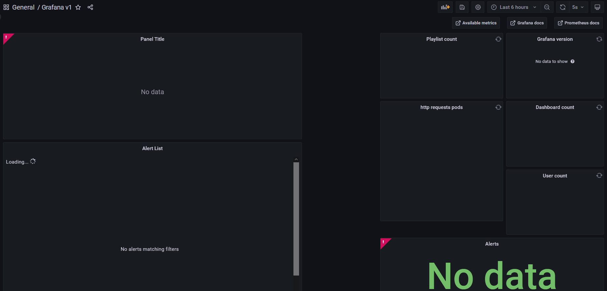
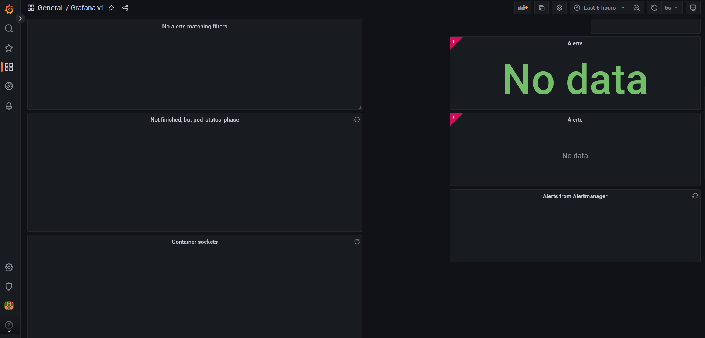
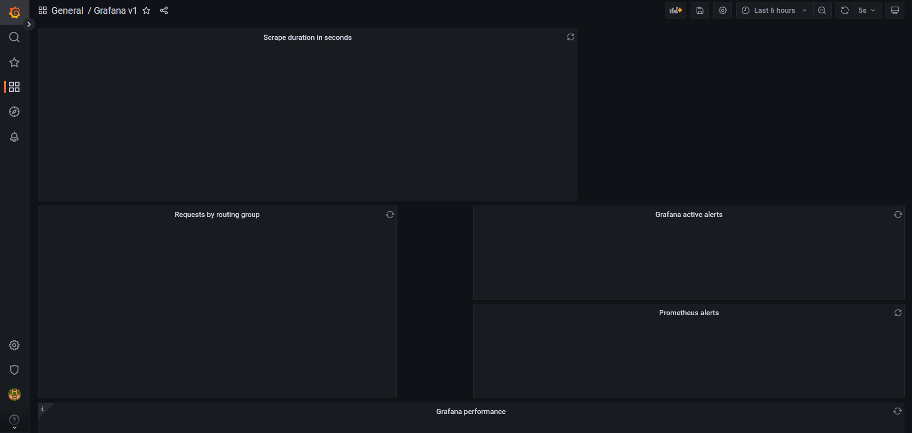
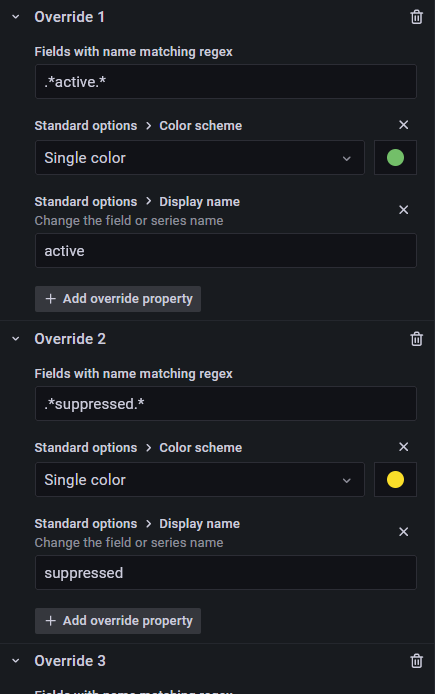
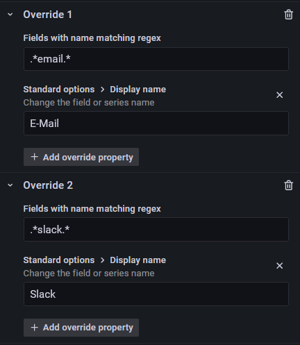
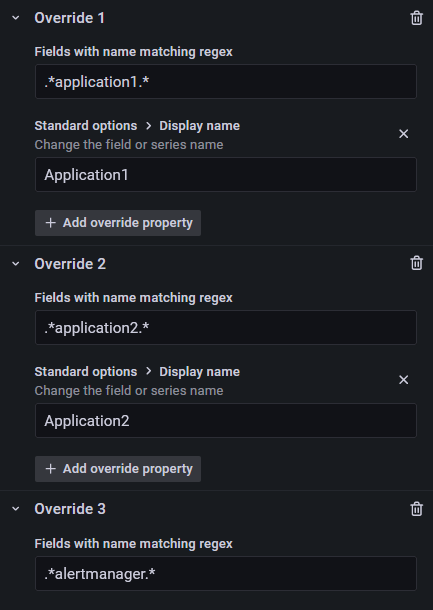

# Grafana Dashboard

Settings from version 1





1. Alert List
2. Playlist count ```grafana_stat_total_playlists```
3. Grafana version ```topk(1, grafana_info or grafana_build_info)```
4. http requests pods ```kubelet_http_requests_total{path="pods"}```
5. Dashboard count ```grafana_stat_totals_dashboard```
6. User count ```grafana_stat_total_users```
7. Alerts ```alertmanager_alerts``` (Stat) </br>
    Overrides: e.g. .*active.* -> Single color: green | Display name: active</br>
    
8. Alerts ```alertmanager_alerts``` (Time series)</br>
    Also Overrides
9. Alerts from Alertmanager ```alertmanager_notifications_total{integration=~"email|slack"}```</br>
    Overrides .*email.* -> E-Mail and .*slack.* -> Slack</br>
    
10. Not finished, but pod_status_phase ```kube_pod_status_phase{namespace="monitoring", pod="application1-deployment-9c78bf68c-hg66l"}``` (Time series)
11. Container sockets ```container_sockets{container=~"application2|application1|alertmanager|prometheus|grafana"}```</br>
    Overrides e.g. .*application1.* -> Application1</br>
    
12. http requests ```sum by(code) (increase(prometheus_http_requests_total[1m]))``` (Time series)
13. Scrape duration in seconds ```topk(5, max(scrape_duration_seconds) by (job))``` (Time series)
14. Requests by routing group A, B and C ```sum(irate(grafana_api_response_status_total[5m]))``` (Time sries)
15. Grafana active alerts ```increase(grafana_alerting_active_alerts[1m])``` (Time series)
16. Prometheus alerts ``` sum (ALERTS)``` (Time series)