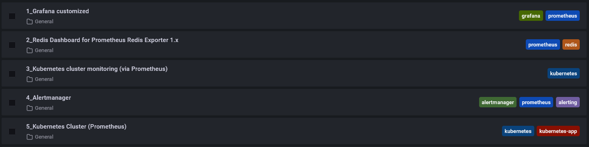
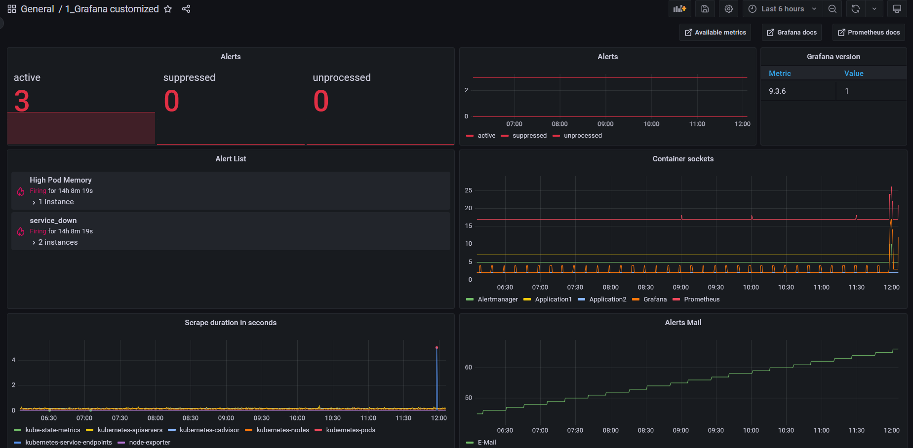
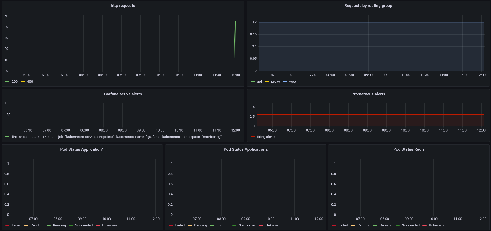

# Grafana Dashboard



## Settings for individual Dashboard



In some Dashboards we made Overrides of the Name

1. Alerts ```sum by(state) (alertmanager_alerts)``` (Stat & Time Series)
2. Grafana version ```topk(1, grafana_info or grafana_build_info)```
3. Alert List -> Alert List (instead of Time Series)
4. Container sockets ```container_sockets{container=~"application2|application1|alertmanager|prometheus|grafana"}```
5. Scrape duration in seconds ```topk(5, max(scrape_duration_seconds) by (job)) ```
6. Alerts mail ```sum by(integration) (alertmanager_notifications_total{integration=~"email"})```
7. http request ```sum by(code) (increase(prometheus_http_requests_total[1m]))```
8. Requests by routing group ```sum(irate(grafana_api_response_status_total[5m]))```
9. Grafana active alerts ```increase(grafana_alerting_active_alerts[1m])```
10. Prometheus alerts ``` sum (ALERTS)```
11. Pod Status Application1 ```kube_pod_status_phase{namespace="monitoring", pod=~"application1-deployment-c6f6bfdd9-c5t98"}```
12. Pod Status Application2 ```kube_pod_status_phase{namespace="monitoring", pod="application2-deployment-86454f46d9-cls6j"}```
13. Pod Status Redis ```kube_pod_status_phase{namespace="monitoring", pod="redis-ddb6bb77c-wvrzj"}```

## Further Dashboards
1. Redis Dashboard for Prometheus Redis Exporter [Grafana Dashboard ID: 11835](https://grafana.com/grafana/dashboards/11835-redis-dashboard-for-prometheus-redis-exporter-helm-stable-redis-ha/)
2. Kubernetes cluster monitoring (via Prometheus) [Grafana Dashboard ID: 315](https://grafana.com/grafana/dashboards/315-kubernetes-cluster-monitoring-via-prometheus/)
3. Alertmanager [Grafana Dashboard ID: 9578](https://grafana.com/grafana/dashboards/9578-alertmanager/)
4. Kubernetes Cluster (Prometheus) [Grafana Dashboard ID: 6417](https://grafana.com/grafana/dashboards/6417-kubernetes-cluster-prometheus/)
